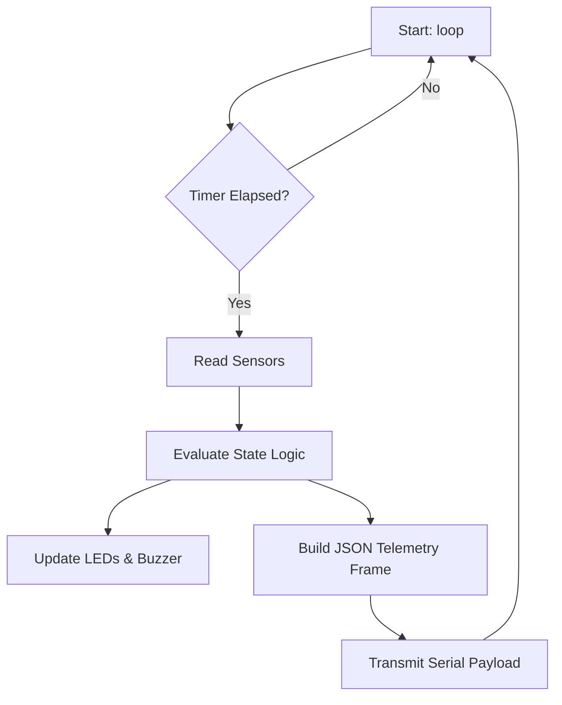
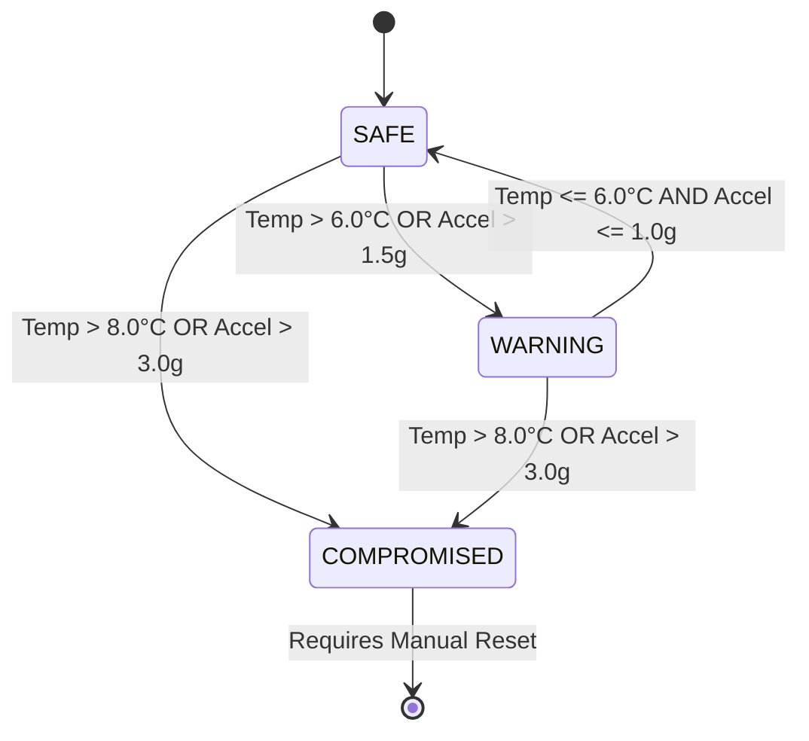

# HemaGrid AI - Smart Cold Box (Hardware + IoT Module)

This module handles real-time environmental and physical telemetry for the blood transportation unit within the HemaGrid AI ecosystem. It reads sensors, processes data locally to evaluate safety states, and streams structured status packets to the local host PC.

---

## 📂 Folder Structure

```text
hardware/
├── README.md                 # Module documentation and architecture reference
├── docs/
│   └── standards_and_milestones.md # Coding standards, documentation guidelines, and task lists
├── firmware/
│   └── smart_cold_box/
│       └── smart_cold_box.ino # Production Arduino firmware
├── schematics/
│   └── connections.md         # Detailed pinouts and circuit descriptions
└── tests/
    └── mock_serial_reader.py  # Python serial integration test script
```

---

## 🛠 Hardware Components

| Component | Purpose | Recommended Model | Specifications |
| :--- | :--- | :--- | :--- |
| **MCU** | Core processing and IO control | Arduino UNO R4 WiFi / Minima | 32-bit Cortex-M4, 5V operating voltage |
| **Temperature Sensor** | Monitor internal thermal state | DHT22 (AM2302) | -40 to 80°C range, ±0.5°C accuracy |
| **Shock / Vibration** | Detect physical impacts in transit | ADXL345 (3-Axis I2C Accelerometer)| ±2g/±4g/±8g/±16g ranges |
| **Status LEDs** | Local physical state display | Green, Yellow, Red 5mm LEDs | Basic indicators with 220Ω resistors |
| **Active Buzzer** | Alert operators of critical failure | 5V Active Piezo Buzzer | Auditory alarm during COMPROMISED state |

---

## 📍 Pin Mapping

| Sensor / Periph | Arduino Pin | Pin Mode | Protocol / Description |
| :--- | :---: | :---: | :--- |
| **DHT22 Data** | Pin 2 | INPUT | 1-Wire Digital interface |
| **ADXL345 SDA** | Pin A4 / SDA | INPUT/OUTPUT | I2C Data line |
| **ADXL345 SCL** | Pin A5 / SCL | INPUT | I2C Clock line |
| **LED Green** | Pin 8 | OUTPUT | High = SAFE state |
| **LED Yellow** | Pin 9 | OUTPUT | High = WARNING state |
| **LED Red** | Pin 10 | OUTPUT | High = COMPROMISED state |
| **Buzzer** | Pin 11 | OUTPUT | High = Audible alarm active |

---

## 🔌 Circuit Diagram

Refer to [schematics/connections.md](file:///C:/Users/Vignesh/snapdragon-hackathon-planning/hardware/schematics/connections.md) for full wiring descriptions. Below is the simplified block schematic:

```text
                 +-------------------+
                 |  Arduino UNO Q    |
                 |                   |
  [DHT22] -------> D2                |
                 |                   |
  [ADXL345] <----> SDA (A4)          |
            <----> SCL (A5)          |
                 |                   |
  [LED Green] <--- D8                |
  [LED Yellow]<--- D9                |
  [LED Red]   <--- D10               |
  [Buzzer]    <--- D11               |
                 +-------------------+
```

---

## 🧠 Firmware Architecture

The firmware is designed around a non-blocking, timer-driven polling architecture. Rather than using CPU-blocking `delay()` instructions, it schedules sensor polling tasks using `millis()`. This maintains low loop latency, enabling future WebSocket and cellular module integration without interrupting critical sensor polling cycles.



---

## 📊 Sensor Thresholds & State Logic

States are calculated locally at the edge using the following rule-set:



*   **SAFE State:**
    *   Temperature: `2.0°C` to `6.0°C` (standard clinical blood cold-chain range).
    *   Shock Acceleration: `< 1.5g` (normal vehicle motion).
*   **WARNING State:**
    *   Temperature: `6.1°C` to `8.0°C` (elevated ambient temperature).
    *   Shock Acceleration: `1.5g` to `3.0g` (rough road surfaces/potholes).
*   **COMPROMISED State:**
    *   Temperature: `> 8.0°C` or `< 2.0°C` (dangerous cold-chain breach).
    *   Shock Acceleration: `> 3.0g` (free-fall drop / severe impact).

---

## 📡 Communication Protocol & JSON Schema

Data is serialized to the hardware UART port at **115200 baud** in JSON format. The packet structure is as follows:

```json
{
  "device_id": "cold_box_001",
  "uptime_ms": 124500,
  "telemetry": {
    "temperature_c": 4.2,
    "humidity_pct": 52.3,
    "acceleration_g": 0.12,
    "max_impact_g": 1.45
  },
  "status": {
    "state": "SAFE",
    "flags": {
      "temp_breached": false,
      "impact_breached": false
    }
  }
}
```

### JSON Validation Schema
```json
{
  "$schema": "http://json-schema.org/draft-07/schema#",
  "type": "object",
  "properties": {
    "device_id": { "type": "string" },
    "uptime_ms": { "type": "integer" },
    "telemetry": {
      "type": "object",
      "properties": {
        "temperature_c": { "type": "number" },
        "humidity_pct": { "type": "number" },
        "acceleration_g": { "type": "number" },
        "max_impact_g": { "type": "number" }
      },
      "required": ["temperature_c", "humidity_pct", "acceleration_g", "max_impact_g"]
    },
    "status": {
      "type": "object",
      "properties": {
        "state": { "type": "string", "enum": ["SAFE", "WARNING", "COMPROMISED"] },
        "flags": {
          "type": "object",
          "properties": {
            "temp_breached": { "type": "boolean" },
            "impact_breached": { "type": "boolean" }
          },
          "required": ["temp_breached", "impact_breached"]
        }
      },
      "required": ["state", "flags"]
    }
  },
  "required": ["device_id", "uptime_ms", "telemetry", "status"]
}
```

---

## 🧪 Testing Guide

### Unit & Hardware Verification
1.  **Hardware Loopback Test:** Connect the Arduino via USB, upload the firmware, and open the Serial Monitor at **115200 baud**. Verify that clean JSON packets are printed every second.
2.  **Thermal Calibration Test:** Apply heat (e.g., body warmth) to the DHT22 sensor. Verify that the state transitions to `WARNING` at 6.1°C and `COMPROMISED` above 8.0°C. Check that LEDs match the state change.
3.  **Impact Threshold Test:** Tap the accelerometer sensor body. Verify `max_impact_g` updates on impact, and state transitions to `COMPROMISED` if a tap exceeds the 3.0g limit.

### Integration Test
Run the python integration validation script to read and test packet formats:
```bash
python tests/mock_serial_reader.py --port COM3 --baud 115200
```

---

## 💡 Snapdragon Integration Plan

```text
+-----------------------+                    +---------------------------+
|  Smart Cold Box (MCU) |                    |  Hospital AI PC (Hub)     |
|                       |                    |                           |
|   Serial UART over USB|------------------->|  - Node.js WebSocket Host |
|                       |  JSON stream       |  - Snapdragon NPU Engine  |
+-----------------------+                    +---------------------------+
```

To support integration with Snapdragon-based hospital management computers:
1.  **Transport Neutrality:** The firmware outputs to serial stream. If WiFi or Cellular shields are added, the telemetry generator remains unchanged; only the transport bridge wrapper changes.
2.  **USB Serial Interface:** The Snapdragon AI PC will run a daemon (Node.js/Python) that binds to the USB COM port, parses the JSON payload, and routes the data to local dashboards and cloud brokers.

---

## 📋 Milestones & Acceptance Criteria

### Milestones
1.  **Milestone 1 (Hardware Setup):** Wiring completed, I2C addresses verified, DHT22 reading successfully.
2.  **Milestone 2 (Firmware Core):** Non-blocking polling loop, state evaluation logic, and LED triggers completed.
3.  **Milestone 3 (Serialization):** JSON serialization verified via serial output. No buffer overflows or memory leaks.
4.  **Milestone 4 (Integration):** Successful data capture using python serial validation test.

### Acceptance Criteria
*   The system must evaluate state changes within 100ms of sensor thresholds being crossed.
*   LED indicators must match the internal calculated state (Green = Safe, Yellow = Warning, Red = Compromised).
*   JSON telemetry frame outputs must be syntactically valid and match the schema.
*   Memory footprint of the Arduino code must remain under 60% dynamic memory limit to prevent memory instability.
